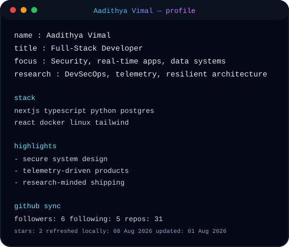

<!--
  ─────────────────────────────────────────────────────────────────────
  aadithya-vimal — profile readme

  No GitHub Actions. No CI. No build step.
  The images below are either live endpoints (stats, streak, badges)
  or SVGs generated locally from live data:

      python scripts/make_ascii_svg.py
      python scripts/make_info_card.py
      python scripts/make_calendar_3d.py
  ─────────────────────────────────────────────────────────────────────
-->

<h1>👋 Hi, I'm Aadithya Vimal</h1>

<b>Full-Stack Developer · Security Researcher · Data Science Builder</b>

I design and build secure web applications, real-time products, and data pipelines —
software that is fast, resilient, and safe by default. My work focuses on
threat-aware architecture, low-latency full-stack apps, and data engineering that
produces decision-grade results.

<table>
<tr>
<td valign="top"></td>
<td valign="top"></td>
</tr>
</table>

 

<!-- live telemetry — shields.io dynamic badges, resolved at request time -->

 
 

<h3>📊 GitHub Stats</h3>

<!-- all four cards are live, rendered fresh on every visit -->
<table>
<tr>
<td></td>
<td></td>
</tr>
<tr>
<td></td>
<td></td>
</tr>
</table>

 
 

<h3>📈 Contributions</h3>

<!-- animated 3D pillar — generated locally from live data -->

 
 

<h3>🧰 My Stack</h3>

<!-- scrolling logo marquee — generated locally from live simple-icons brand logos -->

 
 

<h3>🚀 Selected Projects</h3>

| project | what it is | stack |
|---|---|---|
| **[ThreatStream](https://threatstream.pages.dev)** | Network security intelligence & traffic analysis | Python · Scapy · Pandas · NumPy · Kali Linux |
| **[PunchIn Tracker](https://punchin-tracker.pages.dev)** | Enterprise resource management & operational analytics | Next.js · TypeScript · Tailwind · Prisma · PostgreSQL |
| **[Axovanth](https://axovanth.pages.dev)** | Enterprise control plane & real-time governance | Next.js · Convex · TypeScript · Clerk |
| **[AURACLE](https://auracle.pages.dev)** | Decentralized AI-powered market intelligence on Solana | React · Solana (Rust/Anchor) · Groq LLM · Python |

 
 

<h3>🔨 Currently Building</h3>

• Threat-aware systems — security engineered in from day one 
• Real-time full-stack products — live data, low latency 
• Data pipelines with decision-grade outputs 
• Secure interfaces that still feel fast

 
 

<h3>🔗 Find Me Online</h3>

 

stats and badges update live · profile art generated locally with the scripts in this repo

